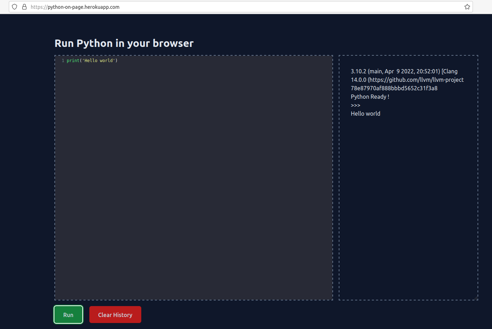

# Python on Page

This is a simple project to run python on page with WebAssembly.

## How to run

Install dependencies with `pip install flask` and then run project with : `python3 main.py`.

Available at [localhost](localhost:8080/) or on [heroku](https://python-on-page.herokuapp.com/).

## Credits

Documentation :

- WebAssembly https://testdriven.io/blog/python-webassembly/
- Pyodide https://pyodide.org/en/stable/
- Heroku deployment https://blog.heroku.com/python_and_django#heroku-python-quickstart